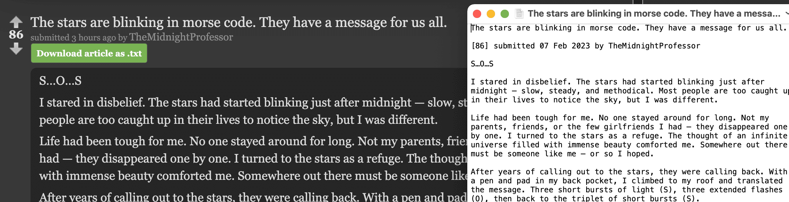

# Reddit Text Saver

Simple Chrome extension that lets you download a text file with the contents of a Reddit article.

Only works with `old.reddit.com` right now.

## Installation

1. Open `chrome://extensions/`
2. Make sure **Developer Mode** is on
3. Click **Load Unpacked**
4. Navigate to this directory and open it.
5. Green button will appear on Reddit pages

## Bugs

- Doesn't work in normal `reddit.com` - the class names get created dynamically - requires more JavaScript trickery to detect each section of text
- Doesn't work when the author has been `[deleted]`
